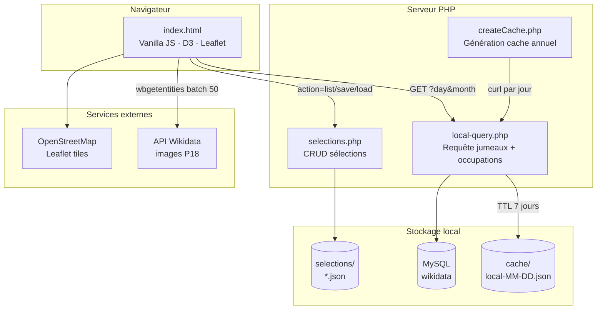
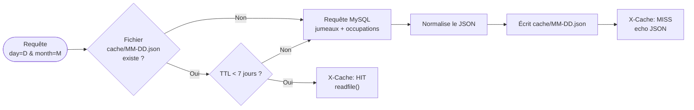
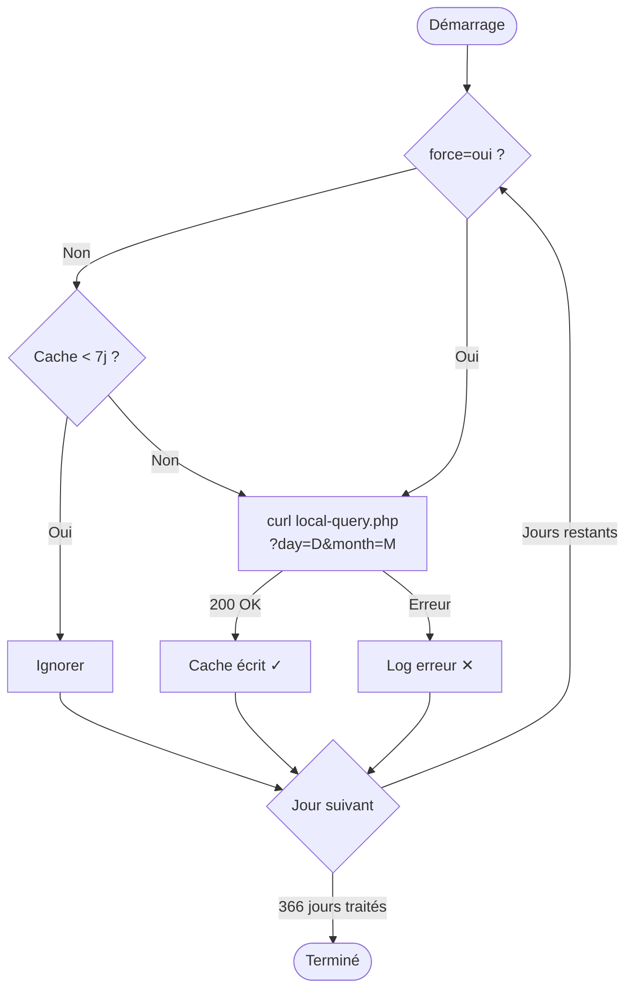
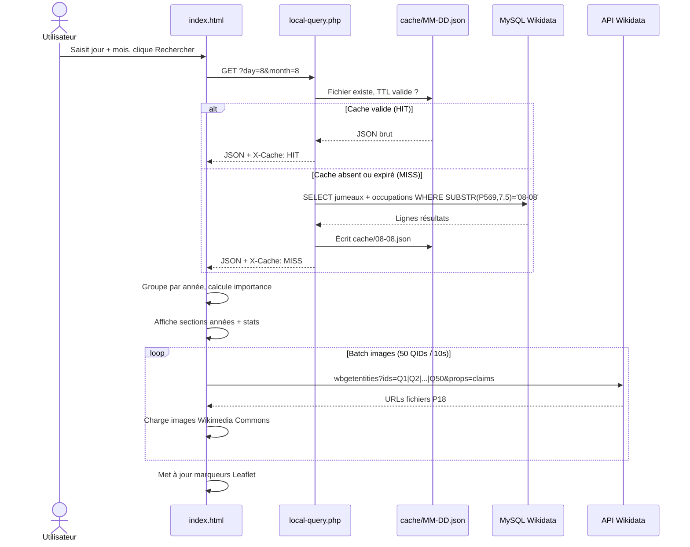
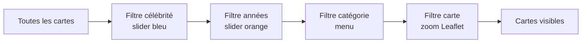
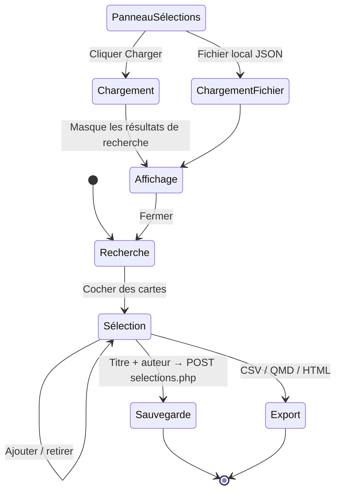

# Jumeaux de Naissance

> Découvrez les personnalités historiques nées le même jour que vous, en interrogeant une base MySQL locale alimentée depuis Wikidata.

**Stack :** PHP 8 · MySQL · Vanilla JS · D3.js v7 · Leaflet · Wikidata

---

## Table des matières

- [Présentation](#présentation)
- [Architecture générale](#architecture-générale)
- [Prérequis](#prérequis)
- [Base de données](#base-de-données)
  - [Schéma](#schéma)
  - [Propriétés Wikidata utilisées](#propriétés-wikidata-utilisées)
  - [Projet monWikidata](#projet-monwikidata)
- [Backend PHP](#backend-php)
  - [Endpoints API](#endpoints-api)
  - [Système de cache](#système-de-cache)
  - [Génération en masse du cache](#génération-en-masse-du-cache)
- [Frontend](#frontend)
  - [Flux de données — recherche](#flux-de-données--recherche)
  - [Fonctionnalités](#fonctionnalités)
  - [Filtres](#filtres)
  - [Sélections](#sélections)

---

## Présentation

L'application suit une architecture classique client-serveur. Le frontend (une seule page HTML) communique avec trois scripts PHP. La base de données MySQL est une copie locale de Wikidata, générée par le projet **monWikidata**.

---

## Architecture générale



---

## Prérequis

- **PHP ≥ 8.0** avec l'extension PDO MySQL
- **MySQL ≥ 5.7** ou MariaDB ≥ 10.4
- La base de données Wikidata locale (voir [monWikidata](#projet-monwikidata))
- Un fichier `config.php` à la racine du projet
- Accès Internet pour les tuiles Leaflet (OpenStreetMap) et les images Wikidata

### config.php

```php
<?php
return [
    'host'    => 'localhost',
    'port'    => 3306,
    'dbname'  => 'wikidata',
    'charset' => 'utf8mb4',
    'user'    => 'root',
    'pass'    => 'motdepasse',
];
```

---

## Base de données

### Schéma

La base est une extraction partielle de Wikidata structurée en cinq tables, produite et maintenue par le projet **monWikidata**.

```mermaid
erDiagram
    wikidata_entities {
        varchar id PK "QID ex: Q42"
        varchar label "Nom principal"
        text description "Courte description"
        int sitelinks "Nb de liens sitelinks"
        int statements "Nb de déclarations"
        int externalIds "Nb d'ID externes"
        varchar wikipedia "lang_Article"
    }
    wikidata_properties {
        int pk PK
        varchar entity_id FK
        varchar property "P569, P106, P18..."
        varchar value_id "QID cible"
        varchar value_str "Valeur texte ou date"
    }
    wikidata_geos {
        varchar id PK "QID lieu"
        varchar label "Nom du lieu"
        float latitude
        float longitude
    }
    wikidata_occupations {
        varchar id PK
        varchar label "Nom de l'occupation"
        varchar labelFr
        text description
        text subclass_of "IDs séparés par |"
    }
    wikidata_nodes {
        varchar id PK
        varchar label
        varchar path
        int depth
    }

    wikidata_entities ||--o{ wikidata_properties : "entity_id"
    wikidata_geos ||--o{ wikidata_properties : "value_id (P19=lieu)"
    wikidata_occupations ||--o{ wikidata_properties : "value_id (P106=métier)"
```

### Propriétés Wikidata utilisées

| Propriété | Libellé | Usage dans l'app |
|-----------|---------|-----------------|
| `P569` | Date de naissance | Filtrage par jour/mois (`SUBSTR(value_str,7,5)`) |
| `P737` | Influencé par | Calcul de l'indice d'importance (`nbInflu`) |
| `P106` | Occupation / métier | Classification par catégorie |
| `P18` | Image | Photo affichée dans la carte, chargée via Wikimedia Commons |
| `P19` | Lieu de naissance | Géolocalisation sur la carte Leaflet |

#### Calcul de l'indice d'importance

```
importance = (sitelinks + statements + externalIds) × (nbInflu + 1)
```

Plus une entité a de liens vers d'autres Wikipédias, de déclarations, d'identifiants externes et de personnes qui l'ont citée comme source d'influence, plus son score est élevé.

### Projet monWikidata

> 🔗 **[github.com/samszo/monWikidata](https://github.com/samszo/monWikidata)**

Scripts Python et SQL pour extraire les données Wikidata (entités, propriétés, géolocalisation, occupations) et les charger dans une base MySQL locale. Jumeaux de Naissance consomme cette base en lecture seule.

> ⚠️ **Dépendance :** sans la base produite par monWikidata, les requêtes de `local-query.php` échoueront. Consultez le README de monWikidata pour les instructions d'installation et de mise à jour.

---

## Backend PHP

### Endpoints API

#### `GET local-query.php`

Retourne les personnalités nées un jour/mois donné, avec leurs occupations. Utilise un cache JSON par date (TTL 7 jours).

| Paramètre | Type | Description |
|-----------|------|-------------|
| `day` | entier 1–31 | Jour du mois |
| `month` | entier 1–12 | Mois |

Réponse : `{ "jumeaux": [...], "occupations": [...] }`  
En-tête : `X-Cache: HIT | MISS`

#### `GET selections.php?action=list`

Liste toutes les sélections enregistrées dans `/selections/`.

#### `POST selections.php?action=save&file={nom}`

Enregistre le corps JSON (sélection complète) dans `/selections/{nom}.json`.

#### `GET selections.php?action=load&file={nom}`

Charge et retourne le contenu d'un fichier de sélection.

#### `GET/CLI createCache.php`

Génère ou régénère le cache JSON pour tous les jours de l'année (voir [Génération en masse](#génération-en-masse-du-cache)).

---

### Système de cache

Chaque requête `local-query.php` est mise en cache dans `cache/local-MM-DD.json` avec un TTL de 7 jours.



---

### Génération en masse du cache

`createCache.php` itère sur les 365/366 jours de l'année et appelle `local-query.php` via `curl` pour chaque date.



#### Utilisation

```bash
# Tous les jours manquants ou expirés
php createCache.php

# Forcer la regénération complète
php createCache.php --force

# Seulement le mois de juin
php createCache.php --month=6
```

Via navigateur :
```
http://monserveur/createCache.php?force=1&month=6
```

---

## Frontend

### Flux de données — recherche



---

### Fonctionnalités

| Fonctionnalité | Description |
|---------------|-------------|
| 🔍 **Recherche par date** | Saisie jour + mois + plage d'années. Résultats groupés par année, triés par importance décroissante. |
| 📊 **Statistiques** | Nombre total de personnalités, année la plus riche, moyenne par an, top 5 années. |
| 🗺 **Carte Leaflet** | Carte interactive OpenStreetMap. Un zoom filtre les cartes aux entités géolocalisées visibles dans le viewport. |
| 🖼 **Images Wikidata** | Chargement groupé (50 entités / requête, intervalle paramétrable). Bouton priorité par année. |
| ⭐ **Sélections** | Sélectionner des personnalités, sauvegarder sur le serveur ou charger un fichier JSON local, exporter en CSV / JSON / QMD / HTML. |
| 🗂 **Vue par catégorie** | Bascule entre la vue par année et la vue par catégorie (politiciens, artistes, scientifiques…). |

---

### Filtres

Le panneau **Filtres** (collapsible) regroupe quatre filtres cumulatifs appliqués en temps réel.



| Filtre | Source | Comportement |
|--------|--------|-------------|
| Indice de célébrité | Slider double bleu | Masque les cartes dont le score est hors de la plage |
| Années | Slider double orange | Masque les sections d'années hors de la plage ; bornes calculées depuis les données |
| Catégorie | Menu déroulant | Filtre par catégorie déduite des occupations Wikidata (P106) |
| Carte géo | Zoom Leaflet | Si zoom > niveau initial, ne conserve que les entités dans le viewport |

---

### Sélections



#### Format JSON d'une sélection

```json
{
  "recherche": {
    "titre":        "Mes jumeaux du 8 août",
    "auteur":       "Samuel Szoniecky",
    "date":         "08/08",
    "periodeDebut": 2020,
    "periodeFin":   1000,
    "exportedAt":   "2026-08-08",
    "total":        12
  },
  "items": [
    {
      "qid":         "Q42",
      "name":        "Douglas Adams",
      "desc":        "romancier et scénariste britannique",
      "year":        1952,
      "wpUrl":       "https://fr.wikipedia.org/wiki/Douglas_Adams",
      "wikidataUrl": "https://www.wikidata.org/wiki/Q42"
    }
  ]
}
```

---

## Licence

Ce projet est open source. Les données proviennent de [Wikidata](https://www.wikidata.org) sous licence [CC0](https://creativecommons.org/publicdomain/zero/1.0/).
